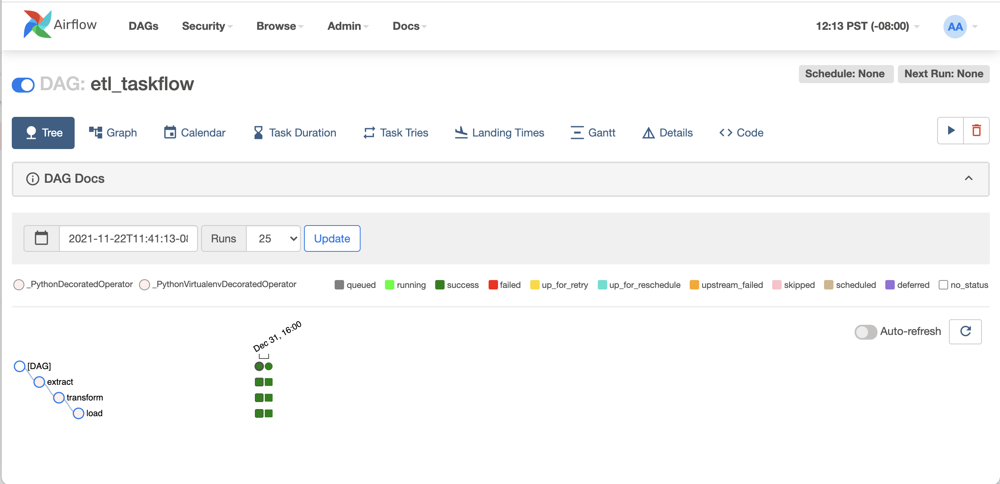

## Objective:
- Briefly introduce Apache Airflow
- Learn the process of Extract, Transform, and Load;
- Learn Directed Acyclic Graph
- Play with Airflow with a sample ETL process

## What's Apache Airflow

Apache Airflow is a open-souce platform for authoring, scheduling and monitoring workflows programmatically. (Workflow as code)

Apache Airflow is a reliable and scalable workflow management system for data pipelines. It is a platform to build and run workflows. Apache Airflow uses *DAG* to organize the workflow. It contains individual *tasks* arranged with dependencies and data flows. Apache Airflow has schedulers, executors, and sensors to fetch data, run analysis and trigger other system on clusters of computer, or Kubernetes.

Airflow is not a data streaming solution. Airflow is not in the *Spark Streaming*[^spark] or *Storm*[^storm] space, it is more comparable to *Oozie*[^oozie], *Azkaban*[^azkaban], or Spotify *Luigi*[^luigi].

Airflow is not a CI/CD platform like *Jenkins*[^jenkins].  Jenkins is for more CI/CD for configuration or triggering any builds or tests and other CD tasks for continuous integrations and deliveries, whileas Airflow is more for considering the production scheduled tasks and hence Airflow are widely used for monitoring and scheduling data pipelines. [^airflow-vs-jenkins]

- Programming language: Python
- License: Apache Licence Version 2.0

### Understand ETL (Extract, Transform, and Load)
"A general procedure of copying data from one or more sources into a destination system which represents the data differently from the source(s) or in a different context than the source(s). The ETL process became a popular concept in the 1970s and is often used in data warehousing." [^etl]

### Understand DAG (Directed Acyclic Graph).
"A finite directed graph with no directed cycles. That is, it consists of finitely many vertices and edges, with each edge directed from one vertex to another, such that there is no way to start at any vertex v and follow a consistently-directed sequence of edges that eventually loops back to v again." [^dag]

## Show me the code

### Running Airflow with Docker

Running Airflow with Docker is the fastest way to start Airflow.

#### Prepare Docker engine and client (on Mac)
1. Install Docker Desktop[^docker-desktop], allocating at least 4GB memory for Docker Engine;
2. Install Docker Compose [^docker-compose] v1.29.2 and newer
#### Deploy Airflow on Docker Compose

 1. Download docker-compose.yaml. The docker-compose.yaml defines the basic Airflow cluster configuration for CeleryExecutor with Redis and PostgreSQL. See the details in the yaml file.

        $ curl -LfO 'https://airflow.apache.org/docs/apache-airflow/2.2.2/docker-compose.yaml'
 
 2. Initialize the databases, check version and memories, etc.

		$ docker-compose up airflow-init
	After initialization is complete, you should see a message like below.

	    airflow-init_1       | Upgrades done
	    airflow-init_1       | Admin user airflow created
	    airflow-init_1       | 2.2.2
	    start_airflow-init_1 exited with code 0

	The account created has the login  `airflow`  and the password  `airflow`.

 3. Running Airflow
 
		$ docker-compose up
		# to chekc the condition of the containers:
		$ docker ps
		❯ docker ps | grep airflow
		CONTAINER ID   IMAGE                          COMMAND                  CREATED        STATUS                  PORTS                                                 NAMES
		120901625f51   redis:latest                   "docker-entrypoint.s…"   10 hours ago   Up 10 hours (healthy)   6379/tcp                                              airflow-redis-1
		0926fb0e4368   postgres:13                    "docker-entrypoint.s…"   10 hours ago   Up 10 hours (healthy)   5432/tcp                                              airflow-postgres-1
		ecefd35702bb   apache/airflow:2.2.2           "/usr/bin/dumb-init …"   2 days ago     Up 36 hours (healthy)   0.0.0.0:5555->5555/tcp, 8080/tcp                      airflow_flower_1
		c431dabf56e6   apache/airflow:2.2.2           "/usr/bin/dumb-init …"   2 days ago     Up 36 hours (healthy)   8080/tcp                                              airflow_airflow-scheduler_1
		9404f213aeeb   apache/airflow:2.2.2           "/usr/bin/dumb-init …"   2 days ago     Up 36 hours (healthy)   8080/tcp                                              airflow_airflow-worker_1
		a4929cbe88d6   apache/airflow:2.2.2           "/usr/bin/dumb-init …"   2 days ago     Up 36 hours (healthy)   8080/tcp                                              airflow_airflow-triggerer_1
		12c9663b2034   apache/airflow:2.2.2           "/usr/bin/dumb-init …"   2 days ago     Up 36 hours (healthy)   0.0.0.0:8080->8080/tcp                                airflow_airflow-webserver_1
 4. Accessing the Airflow platform

	 4.1 by CLI commands:
	 
	    $ docker-compose run airflow-worker airflow info
	Or

		$ curl -LfO 'https://airflow.apache.org/docs/apache-airflow/2.2.2/airflow.sh'
		$ chmod +x airflow.sh
		$ ./airflow.sh info		# show information about current Airflow and environment
		$ ./airflow.sh bash		# to enter interactive bash shell in the container
		$ ./airflow.sh python		# to enter interactive python shell in the container
		$ ./airflow.sh --help		# for usage
	 4.2 by the web UI
	 The webserver is available at:  `http://localhost:8080`. The default account has the login  `airflow`  and the password  `airflow`.
	 
	 4.3 by the REST API
	 
        $ ENDPOINT_URL="http://localhost:8080/"
        $ curl -X GET  \
            --user "airflow:airflow" \
            "${ENDPOINT_URL}/api/v1/pools"

 5. Cleaning up

        $ docker-compose down --volumes --rmi all

### Programming DAG

1. Create an example DAG file `ETL_taskflow.py` under `~/dags` directory, as the following:

        from datetime import datetime
        from airflow.decorators import dag,task
        
        @dag(
            schedule_interval=None,
            start_date=datetime(2021, 1, 1),
            catchup=False, tags=['etl'])
        def  etl_taskflow():
            """
            ### ETL process with Airflow TaskFlow
            ETL data pipeline with using the Airflow TaskFlow
            """
            @task.virtualenv(
            use_dill=True,
            system_site_packages=False,
            requirements=['funcsigs'],
            )
            def extract():
                """
                #### Extract task
                Extract task to get data ready for the rest of the pipeline
                """
                import  json
                data_string = '{"data": [-1, 3, 7]}'
                return  json.loads(data_string)
            
            @task(multiple_outputs=True)
            def  transform(order_data: dict):
                """
                #### Transform task
                Transform task takes in the collection of order data 
                and calculate their magnitude
                """
                def dot(v, w):
                    """v_1 * w_1 + ... + v_n * w_n"""
                    return  sum(v_i * w_i
                        for  v_i, w_i  in  zip(v, w))

                def sum_of_squares(v):
                    """v_1 * v_1 + ... + v_n * v_n"""
                    return  dot(v, v)
                
                def magnitude(v):
                    import  math
                    return  math.sqrt(sum_of_squares(v))

                data_magnitude = magnitude(order_data['data'])
                return {"data_magniture": data_magnitude}
            
            @task()
            def  load(data_magnitude: float):
                """
                #### Load task
                Load task takes in the result of the Transform task 
                and print it out.
                """
                print(f'Magnitude of data: {data_magnitude:.2f}')

            load(transform(extract())['data_magniture'])
        
        etl_taskflow = etl_taskflow()

2. Test, deploy and run your DAG

		$ ./airflow.sh bash			# enter to bash in container

		airflow@1c0b4dbbd233:/opt/airflow$ python dags/ETL_taskflow.py
		airflow@1c0b4dbbd233:/opt/airflow$ airflow dags list
		...
		dag_id                                  | filepath                                                                                                         | owner   | paused
		========================================+==================================================================================================================+=========+=======
		etl_taskflow                            | ETL_taskflow.py                                                                                                  | airflow | None

		airflow@1c0b4dbbd233:/opt/airflow$ airflow tasks list etl_taskflow
		extract
		load
		transform
		airflow@1c0b4dbbd233:/opt/airflow$ airflow dags test etl_taskflow 2021-1-1
		...
		[2021-11-22 19:58:07,290] {backfill_job.py:397} INFO - [backfill progress] | finished run 1 of 1 | tasks waiting: 0 | succeeded: 3 | running: 0 | failed: 0 | skipped: 0 | deadlocked: 0 | not ready: 0
		[2021-11-22 19:58:07,295] {backfill_job.py:851} INFO - Backfill done. Exiting.

You also could run the DAG on web UI:

## Feature(s) for future exploring
We do not dig into many Airflow concepts yet, for example: REST API, Plugins, Kubernetes executors, the connection with Jenkins and Slack etc. Please leave message if you are interested. 

## References:
[^jenkins]: Jenkins - a self-contained, open source automation server
https://www.jenkins.io/
[^airflow-vs-jenkins]: Airflow vs. Jenkins
https://www.educba.com/airflow-vs-jenkins/
[^etl]: ETL Defination:
https://en.wikipedia.org/wiki/Extract,_transform,_load
[^dag]: DAG Defination on Wikipedia 
https://en.wikipedia.org/wiki/Directed_acyclic_graph
[^azkaban]: Azkaban - A batch workflow job scheduler
https://azkaban.github.io/
[^oozie]: Apache Oozie - a workflow scheduler system to manage Apache Hadoop jobs.
http://oozie.apache.org/
[^luigi]: Spotify Luigi - an execution framework created to create data pipelines
https://github.com/spotify/luigi
[^airflow]: Apache Airflow Documentation:
https://airflow.apache.org/docs/apache-airflow/stable/
[^docker-desktop]: Install Docker Desktop
https://docs.docker.com/desktop/mac/install/
[^docker-compose]: Install Docker Compose
https://docs.docker.com/compose/install/
[^flower]: Flower - Celery monitoring tool
https://flower.readthedocs.io/en/latest/
[^celery]: Celery - Distributed Task Queue
https://docs.celeryproject.org/en/stable/
[^spark]: Apache Spark is a unified analytics engine for large-scale data processing.
http://spark.apache.org/docs/latest/index.html
[^storm]: Apache Storm is a free and open source distributed realtime computation system.
http://storm.apache.org/index.html
